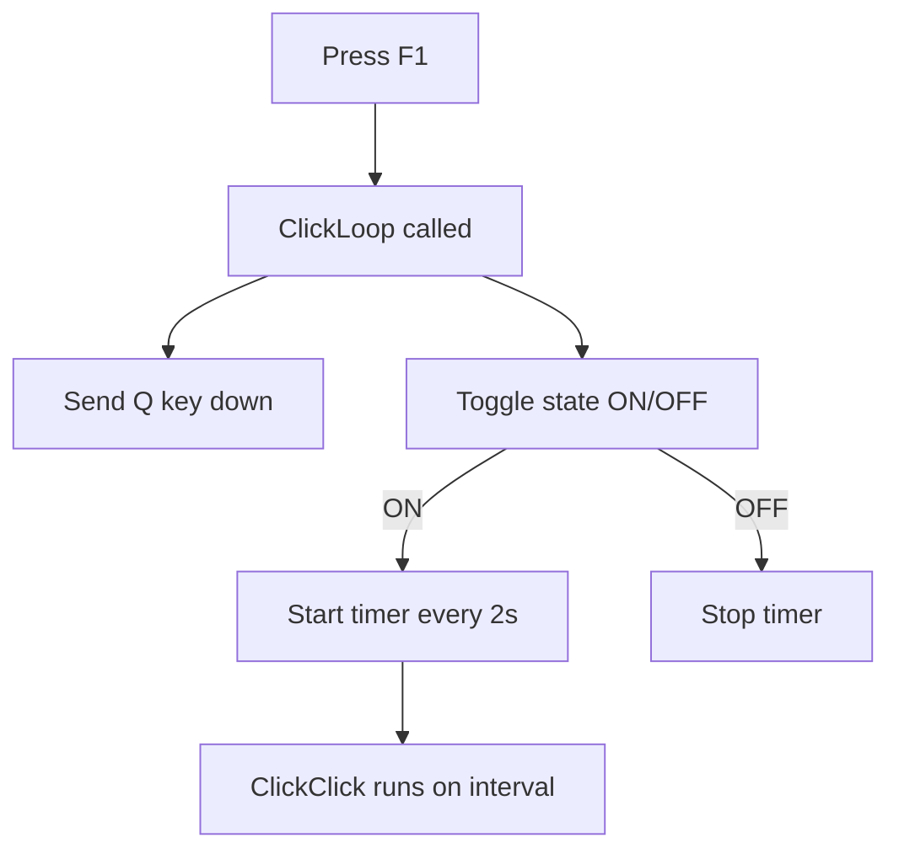
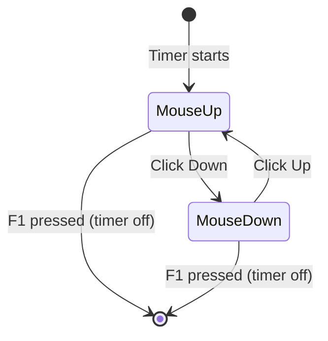
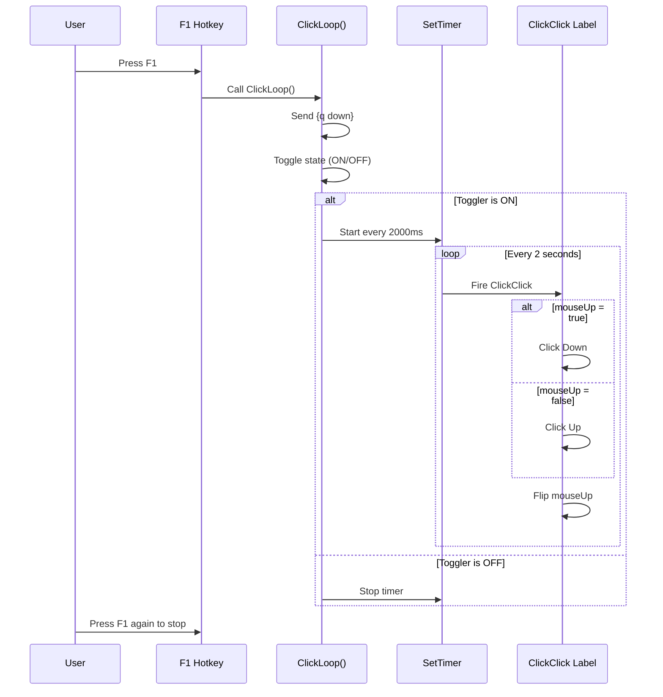

# unbroken-ahk

AutoHotkey scripts for automation.

## left-click-hold-loop.ahk

Toggles an auto-clicker that alternates between holding and releasing the left mouse button on a timed interval. Press **F1** to start/stop.

### How It Works

### Click Toggle Cycle

### Execution Flow

