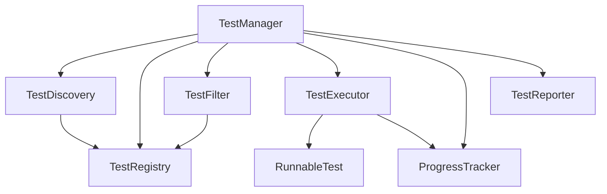
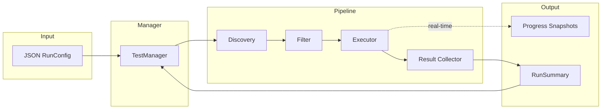
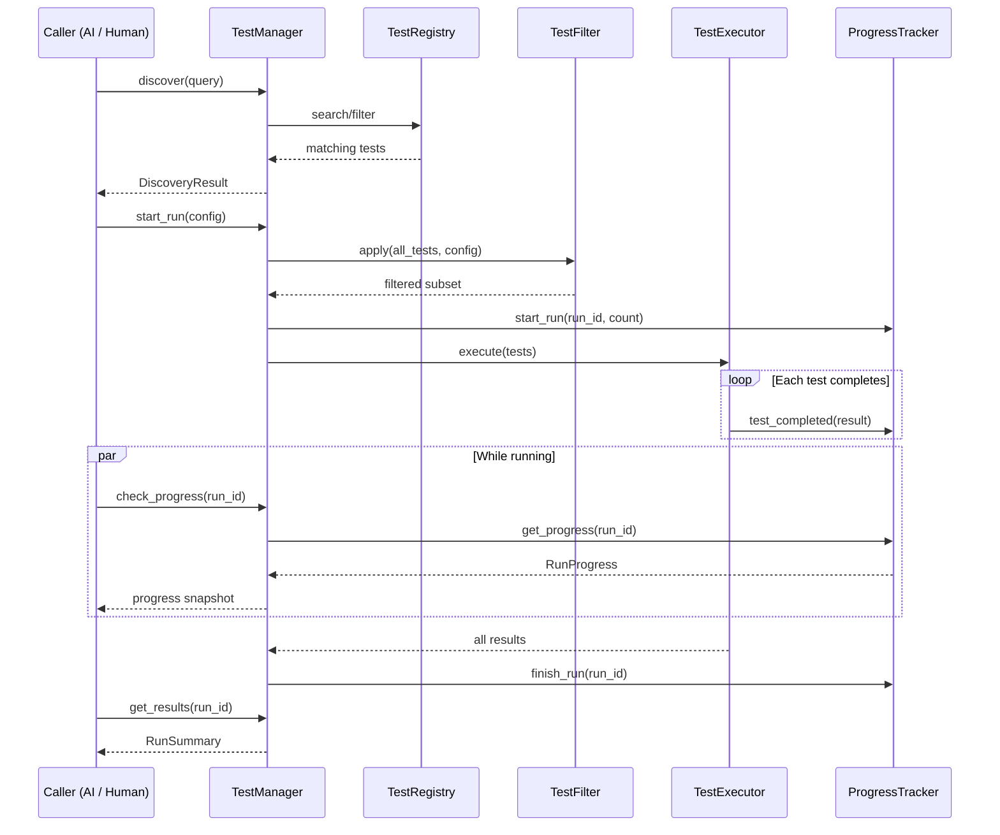

# Interface Specification

## Unbroken Test Platform — Rust Trait Definitions

This document describes the interfaces (Rust traits) that form the contract
between components of the test platform. All implementations must be pure Rust
with zero third-party dependencies and must be WASM-compatible.

---

## Module Overview

```
src/
├── lib.rs          Module root
├── types.rs        Core data structures (no behavior)
├── registry.rs     TestRegistry trait — source of truth for test definitions
├── filter.rs       TestFilter trait — selects test subsets from config
├── executor.rs     RunnableTest + TestExecutor traits — runs tests
├── progress.rs     ProgressTracker trait — real-time run monitoring
├── discovery.rs    TestDiscovery trait — caller-facing search/explore API
├── reporter.rs     TestReporter trait — formats results for output
└── manager.rs      TestManager trait — top-level orchestrator
```

---

## Interface Dependency Diagram



---

## Data Flow



---

## Traits

### `TestRegistry` — `src/registry.rs`

Source of truth for all known tests.

| Method | Signature | Purpose |
|---|---|---|
| `register` | `(&mut self, TestDefinition) -> Result<(), RegistryError>` | Add a test |
| `deregister` | `(&mut self, &str) -> Option<TestDefinition>` | Remove a test |
| `get` | `(&self, &str) -> Option<&TestDefinition>` | Lookup by ID |
| `list_all` | `(&self) -> Vec<&TestDefinition>` | All tests |
| `count` | `(&self) -> usize` | Total count |
| `search_by_name` | `(&self, &str) -> Vec<&TestDefinition>` | Name search |
| `filter_by_tags` | `(&self, &[String]) -> Vec<&TestDefinition>` | Tag filter |
| `filter_by_group` | `(&self, &str) -> Vec<&TestDefinition>` | Group filter |
| `all_tags` | `(&self) -> Vec<String>` | Known tags |
| `all_groups` | `(&self) -> Vec<String>` | Known groups |

### `TestFilter` — `src/filter.rs`

Applies RunConfig criteria to produce the execution subset.

| Method | Signature | Purpose |
|---|---|---|
| `apply` | `(&self, &[&TestDefinition], &RunConfig) -> Vec<&TestDefinition>` | Filter tests |

Filter precedence: include IDs → include tags → name pattern → exclude tags.

### `RunnableTest` — `src/executor.rs`

Wraps actual test logic. Each test in the system implements this.

| Method | Signature | Purpose |
|---|---|---|
| `id` | `(&self) -> &str` | Test identity |
| `run` | `(&self, Option<DurationMs>) -> TestResult` | Execute the test |

### `TestExecutor` — `src/executor.rs`

Runs a batch of tests and reports results as they complete.

| Method | Signature | Purpose |
|---|---|---|
| `execute` | `(&self, &[&dyn RunnableTest], ...) -> Vec<TestResult>` | Run batch |

Supports `fail_fast` and per-test `on_result` callback for progress.

### `ProgressTracker` — `src/progress.rs`

Real-time visibility into running suites.

| Method | Signature | Purpose |
|---|---|---|
| `start_run` | `(&mut self, RunId, u32)` | Begin tracking |
| `test_started` | `(&mut self, &str, &str)` | Mark test as running |
| `test_completed` | `(&mut self, &str, &TestResult)` | Record result |
| `get_progress` | `(&self, &str) -> Option<RunProgress>` | Snapshot |
| `finish_run` | `(&mut self, &str)` | Mark complete |
| `active_runs` | `(&self) -> Vec<RunId>` | List in-flight runs |

### `TestDiscovery` — `src/discovery.rs`

Caller-facing search and explore API.

| Method | Signature | Purpose |
|---|---|---|
| `discover` | `(&self, &DiscoveryQuery) -> DiscoveryResult` | Search tests |
| `summary` | `(&self) -> DiscoverySummary` | Overview stats |

### `TestReporter` — `src/reporter.rs`

Formats output for delivery.

| Method | Signature | Purpose |
|---|---|---|
| `format_summary` | `(&self, &RunSummary, ReportFormat) -> String` | Format results |
| `format_progress` | `(&self, &RunProgress, ReportFormat) -> String` | Format progress |

Supports `Json` and `Text` output formats.

### `TestManager` — `src/manager.rs`

Top-level orchestrator. Both MCP and console interfaces talk to this.

| Method | Signature | Purpose |
|---|---|---|
| `discover` | `(&self, &DiscoveryQuery) -> DiscoveryResult` | Search tests |
| `summary` | `(&self) -> DiscoverySummary` | Overview |
| `register_test` | `(&mut self, TestDefinition) -> Result<(), ManagerError>` | Add test |
| `start_run` | `(&mut self, RunConfig) -> Result<RunId, ManagerError>` | Kick off run |
| `check_progress` | `(&self, &str) -> Result<RunProgress, ManagerError>` | Check in |
| `active_runs` | `(&self) -> Vec<RunId>` | List running |
| `get_results` | `(&self, &str) -> Result<RunSummary, ManagerError>` | Final results |

---

## Caller Interaction Sequence



---

*Next step: Implement concrete structs behind these traits.*
