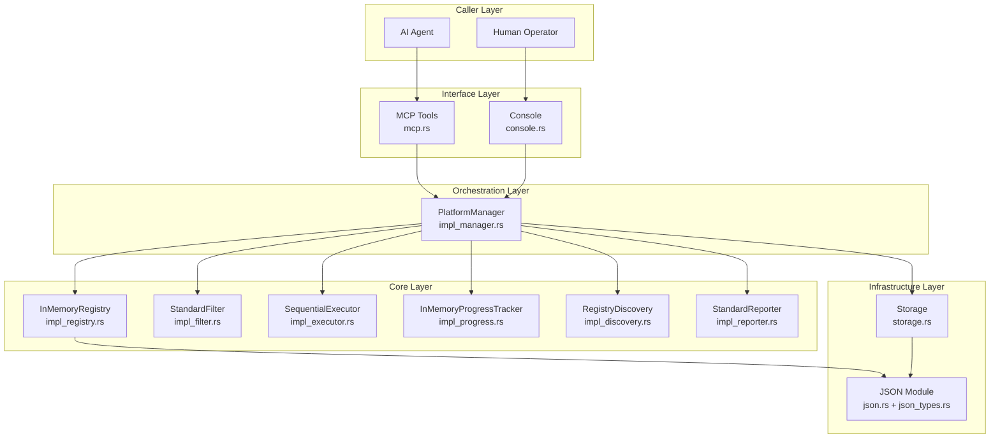
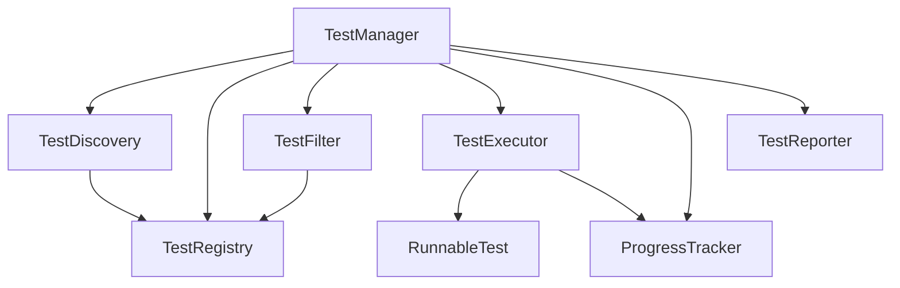
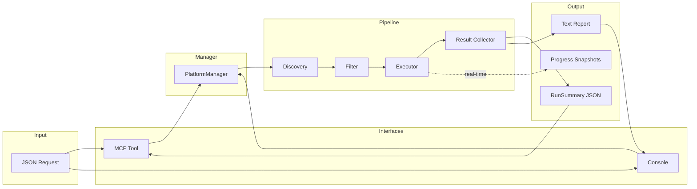
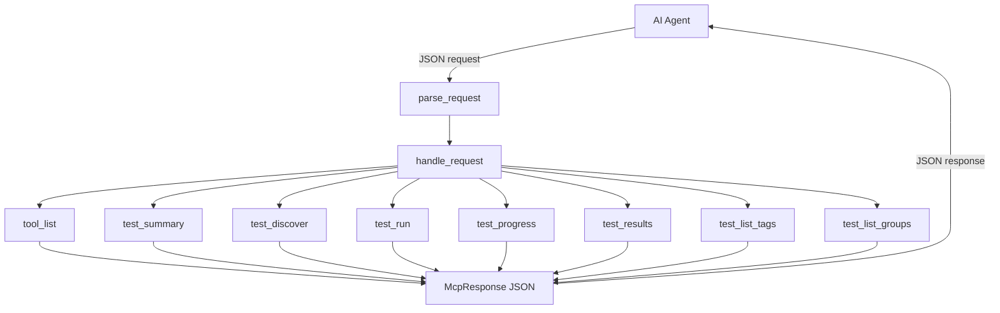
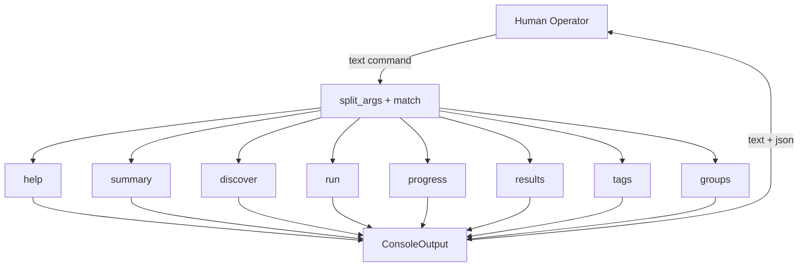
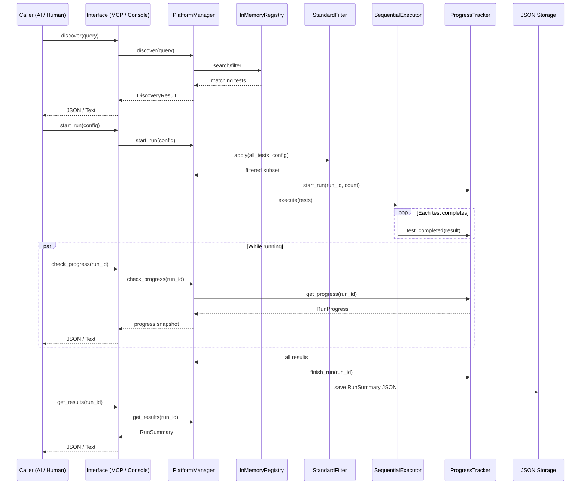

# Interface Specification

## Unbroken Test Platform — Rust Trait Definitions

This document describes the interfaces (Rust traits) that form the contract
between components of the test platform, and the concrete implementations
behind them. All code is pure Rust with zero third-party dependencies and
is WASM-compatible.

---

## Module Overview

```
src/
├── lib.rs                Module root
│
│   Traits (interfaces)
├── types.rs              Core data structures (no behavior)
├── registry.rs           TestRegistry trait
├── filter.rs             TestFilter trait
├── executor.rs           RunnableTest + TestExecutor traits
├── progress.rs           ProgressTracker trait
├── discovery.rs          TestDiscovery trait
├── reporter.rs           TestReporter trait
├── manager.rs            TestManager trait
│
│   Infrastructure
├── json.rs               Hand-rolled JSON parser + serializer
├── json_types.rs         ToJson/FromJson for all domain types
├── storage.rs            JSON file persistence (with WASM stubs)
│
│   Concrete implementations
├── impl_registry.rs      InMemoryRegistry
├── impl_filter.rs        StandardFilter
├── impl_executor.rs      SequentialExecutor
├── impl_progress.rs      InMemoryProgressTracker
├── impl_discovery.rs     RegistryDiscovery
├── impl_reporter.rs      StandardReporter (JSON + Text)
├── impl_manager.rs       PlatformManager (top-level orchestrator)
│
│   Caller interfaces
├── console.rs            Console interface (human operators)
└── mcp.rs                MCP tool interface (AI agents)
```

---

## System Architecture



---

## Interface Dependency Diagram (Traits)



---

## Data Flow



---

## Traits

### `TestRegistry` — `src/registry.rs`

Source of truth for all known tests.

| Method | Signature | Purpose |
|---|---|---|
| `register` | `(&mut self, TestDefinition) -> Result<(), RegistryError>` | Add a test |
| `deregister` | `(&mut self, &str) -> Option<TestDefinition>` | Remove a test |
| `get` | `(&self, &str) -> Option<&TestDefinition>` | Lookup by ID |
| `list_all` | `(&self) -> Vec<&TestDefinition>` | All tests |
| `count` | `(&self) -> usize` | Total count |
| `search_by_name` | `(&self, &str) -> Vec<&TestDefinition>` | Name search |
| `filter_by_tags` | `(&self, &[String]) -> Vec<&TestDefinition>` | Tag filter |
| `filter_by_group` | `(&self, &str) -> Vec<&TestDefinition>` | Group filter |
| `all_tags` | `(&self) -> Vec<String>` | Known tags |
| `all_groups` | `(&self) -> Vec<String>` | Known groups |

**Implementation**: `InMemoryRegistry` — Vec-backed, JSON serializable.

### `TestFilter` — `src/filter.rs`

Applies RunConfig criteria to produce the execution subset.

| Method | Signature | Purpose |
|---|---|---|
| `apply` | `(&self, &[&TestDefinition], &RunConfig) -> Vec<&TestDefinition>` | Filter tests |

Filter precedence: include IDs → include tags → name pattern → exclude tags.

**Implementation**: `StandardFilter` — supports glob patterns, tag intersection, exclusion.

### `RunnableTest` — `src/executor.rs`

Wraps actual test logic. Each test in the system implements this.

| Method | Signature | Purpose |
|---|---|---|
| `id` | `(&self) -> &str` | Test identity |
| `run` | `(&self, Option<DurationMs>) -> TestResult` | Execute the test |

### `TestExecutor` — `src/executor.rs`

Runs a batch of tests and reports results as they complete.

| Method | Signature | Purpose |
|---|---|---|
| `execute` | `(&self, &[&dyn RunnableTest], ...) -> Vec<TestResult>` | Run batch |

Supports `fail_fast` and per-test `on_result` callback for progress.

**Implementation**: `SequentialExecutor` — runs tests one at a time, skips remaining on fail_fast.

### `ProgressTracker` — `src/progress.rs`

Real-time visibility into running suites.

| Method | Signature | Purpose |
|---|---|---|
| `start_run` | `(&mut self, RunId, u32)` | Begin tracking |
| `test_started` | `(&mut self, &str, &str)` | Mark test as running |
| `test_completed` | `(&mut self, &str, &TestResult)` | Record result |
| `get_progress` | `(&self, &str) -> Option<RunProgress>` | Snapshot |
| `finish_run` | `(&mut self, &str)` | Mark complete |
| `active_runs` | `(&self) -> Vec<RunId>` | List in-flight runs |

**Implementation**: `InMemoryProgressTracker` — pluggable clock, JSON serializable.

### `TestDiscovery` — `src/discovery.rs`

Caller-facing search and explore API.

| Method | Signature | Purpose |
|---|---|---|
| `discover` | `(&self, &DiscoveryQuery) -> DiscoveryResult` | Search tests |
| `summary` | `(&self) -> DiscoverySummary` | Overview stats |

**Implementation**: `RegistryDiscovery` — delegates to registry, supports pagination.

### `TestReporter` — `src/reporter.rs`

Formats output for delivery.

| Method | Signature | Purpose |
|---|---|---|
| `format_summary` | `(&self, &RunSummary, ReportFormat) -> String` | Format results |
| `format_progress` | `(&self, &RunProgress, ReportFormat) -> String` | Format progress |

Supports `Json` and `Text` output formats.

**Implementation**: `StandardReporter` — JSON for AI, text with progress bars for humans.

### `TestManager` — `src/manager.rs`

Top-level orchestrator. Both MCP and console interfaces talk to this.

| Method | Signature | Purpose |
|---|---|---|
| `discover` | `(&self, &DiscoveryQuery) -> DiscoveryResult` | Search tests |
| `summary` | `(&self) -> DiscoverySummary` | Overview |
| `register_test` | `(&mut self, TestDefinition) -> Result<(), ManagerError>` | Add test |
| `start_run` | `(&mut self, RunConfig) -> Result<RunId, ManagerError>` | Kick off run |
| `check_progress` | `(&self, &str) -> Result<RunProgress, ManagerError>` | Check in |
| `active_runs` | `(&self) -> Vec<RunId>` | List running |
| `get_results` | `(&self, &str) -> Result<RunSummary, ManagerError>` | Final results |

**Implementation**: `PlatformManager` — wires all components, persists to JSON storage.

---

## MCP Tools — `src/mcp.rs`

The AI-facing interface. Each tool accepts JSON params and returns a JSON response.



| Tool | Parameters | Returns |
|---|---|---|
| `tool_list` | — | Array of tool descriptors with parameter schemas |
| `test_summary` | — | Total tests, tags with counts, groups with counts |
| `test_discover` | `name_pattern`, `tags`, `group`, `limit`, `offset` | Matching tests, total count, available tags/groups |
| `test_run` | `run_all`, `include_ids`, `include_tags`, `exclude_tags`, `name_pattern`, `fail_fast`, `timeout_ms` | RunSummary with per-test results |
| `test_progress` | `run_id` (optional) | RunProgress or list of active runs |
| `test_results` | `run_id` | RunSummary |
| `test_list_tags` | — | Tags with counts |
| `test_list_groups` | — | Groups with counts |

---

## Console Commands — `src/console.rs`

The human-facing interface. Text commands in, text + JSON out.



Every command returns `ConsoleOutput { text, json }` — text for the terminal,
JSON for debugging/storage.

---

## Caller Interaction Sequence



---

## JSON Storage Layout

All platform state persists as human-readable JSON files:

```
<storage_dir>/
├── registry.json              All registered test definitions
└── runs/
    ├── run_0001.json          Results of first run
    ├── run_0002.json          Results of second run
    └── ...
```

---

## Test Coverage

72 tests across all modules:

| Module | Tests | Coverage |
|---|---|---|
| `json` | 4 | Parse, serialize, round-trip, escaping |
| `impl_registry` | 5 | Register, deregister, search, filter, JSON round-trip |
| `impl_filter` | 4 | Run all, include by ID, exclude by tag, name pattern |
| `impl_executor` | 2 | Sequential execution, fail_fast skip |
| `impl_progress` | 2 | Progress tracking, finish/active |
| `impl_discovery` | 4 | Discover all, by group, pagination, summary |
| `impl_reporter` | 2 | Text format, JSON format |
| `impl_manager` | 2 | Full lifecycle, filtered run |
| `storage` | 1 | Path formatting |
| `console` | 20 | All commands, error cases, output formats |
| `mcp` | 26 | All tools, error handling, full AI workflow |
