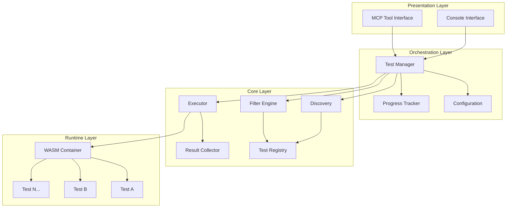
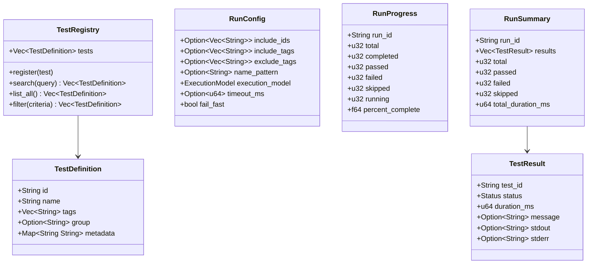
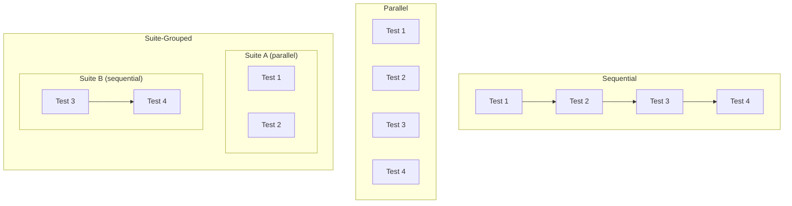
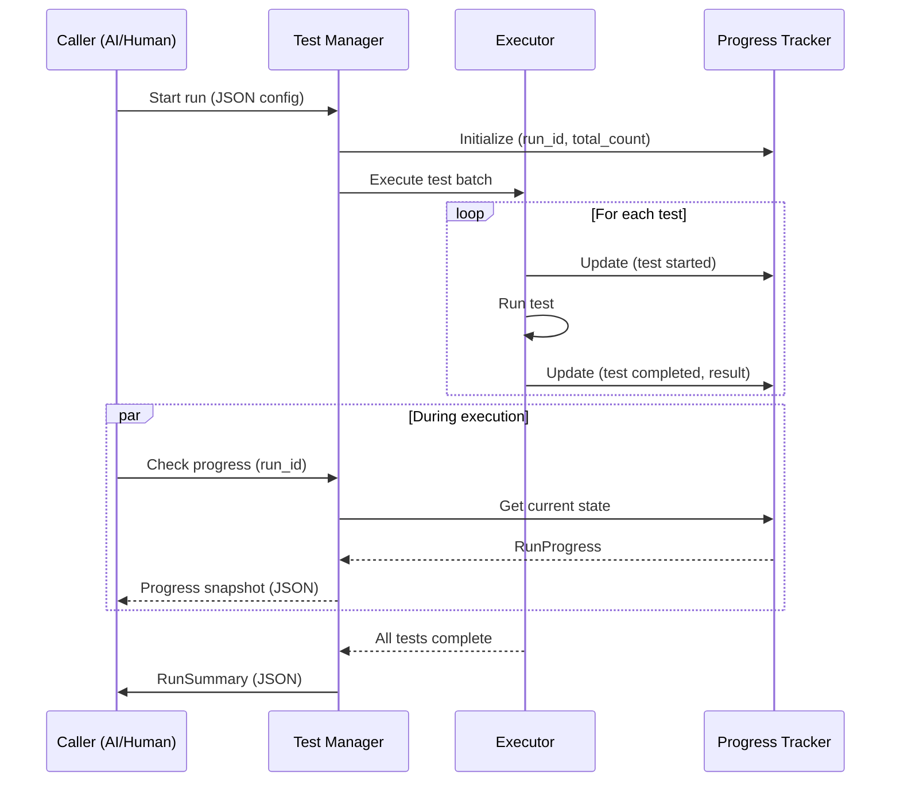
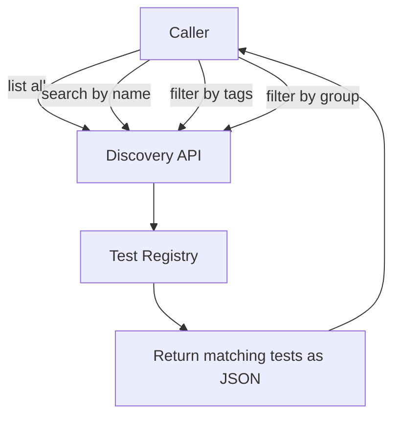
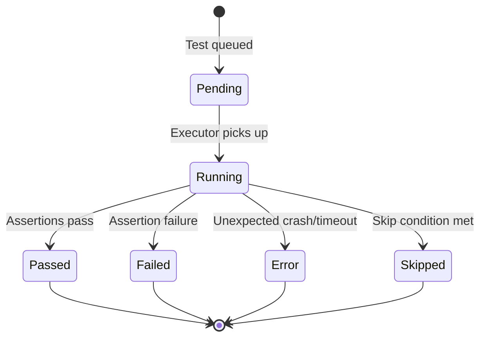

# Test System General Needs Analysis

This document captures the common patterns found across test orchestration systems
(JUnit, pytest, cargo test, GoogleTest, vstest, etc.) to inform the design of the
Unbroken Test Platform.

---

## Core Components

Every test system has these fundamental pieces:

| Component | Responsibility |
|---|---|
| Test Registry | Knows what tests exist, holds metadata |
| Test Discovery | Scans and populates the registry |
| Test Filter | Selects a subset based on criteria |
| Test Runner/Manager | Orchestrates the full lifecycle |
| Test Executor | Actually runs individual tests |
| Progress Tracker | Tracks state of an in-flight run |
| Result Collector | Aggregates outcomes from execution |
| Reporter | Formats and delivers results to the caller |

---

## Layered Architecture



---

## Lifecycle Phases

Every test run moves through these phases regardless of framework:


| Phase | What Happens |
|---|---|
| Discovery | Scan for available tests, build the registry |
| Collection | Aggregate tests into executable units, resolve metadata |
| Filtering | Apply include/exclude criteria from the run configuration |
| Planning | Determine execution order, parallelism, grouping |
| Execution | Run tests, capture output, handle timeouts |
| Result Collection | Aggregate pass/fail/skip/error outcomes and metrics |
| Reporting | Format and deliver results to the requesting caller |

---

## Core Abstractions

These are the data structures every test system defines in some form:



---

## Execution Models

Test systems support different execution strategies:



For the Unbroken platform, key decisions:
- Tests can run in the manager's WASM container (in-process)
- Tests can spawn into their own WASM containers (isolated)
- Both models may coexist depending on test needs

---

## Progress Tracking



---

## Discovery and Search



Discovery is a prerequisite step — callers query the registry before deciding
what to run. The registry must support:

- **List all** — enumerate every registered test
- **Search by name** — substring or pattern match on test names
- **Filter by tags** — include/exclude based on tag sets
- **Filter by group** — select tests belonging to a logical group

---

## Result Status



---

## Configuration Input (JSON)

A run request would look something like:

```json
{
  "run_all": false,
  "include_ids": ["test_auth_basic", "test_auth_token"],
  "include_tags": ["smoke"],
  "exclude_tags": ["slow"],
  "name_pattern": "auth_*",
  "fail_fast": true,
  "timeout_ms": 30000
}
```

When `run_all` is true, filters are ignored and the full suite executes.

---

## Summary of General Needs

1. **Registry** — A single source of truth for what tests exist
2. **Discovery/Search** — Query the registry before running
3. **Flexible Filtering** — By ID, name, tag, group, pattern
4. **Configurable Execution** — Sequential, parallel, or grouped
5. **Progress Visibility** — Real-time check-in during runs
6. **Structured Results** — Machine-readable output (JSON) with status, timing, output capture
7. **Dual Interface** — Same core, different front-ends (MCP for AI, console for humans)
8. **Isolation** — Tests should not affect each other

---

*Next step: Map these general needs onto the specific Unbroken Test Platform
architecture, considering pure Rust, zero dependencies, and edge WASM constraints.*
